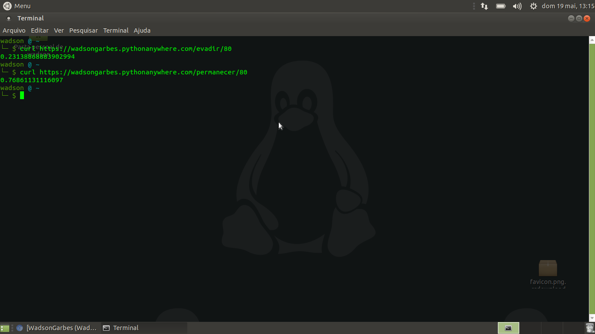

## Machine Learning utilizando regressão logística em dataset americano para predição de evasão escolar
## [DEMO](https://wadsongarbes.pythonanywhere.com)
### Por onde começar ?

Estas instruções darão à você uma cópia do projeto rodando em sua máquina local para testes e feedback. Todas as instruções para baixar e rodar a aplicação se encontram abaixo!
### Pré-requisitos

```
Shell Linux 
```
```
Python2.7
```
```
pip
```
```
virtualenv
```
```
Este repositório
```

### Instalando

Por padrão, toda distribuição Linux acompanha Python2.7 e Python3.x. É possível verificar isto abrindo um shell em seu ambiente Linux e digitando:

```
$ python --version
```

Daí então podemos começar a instalar as dependências para rodar a aplicação:

```
$ sudo apt install pip
```

pip é o instalador de pacotes do python, necessário para instalação das dependências da aplicação

```
$ sudo apt install virtualenv
```

Responsável por isolar nossa aplicação da máquina "hospedeira", garantido um controle maior sobre as dependências da aplicação

```
$ git clone https://github.com/wadsongarbes/wmlapp wmlapp
```

cria e ativa um ambiente virtual

```
$ virtualenv venv && . venv/bin/activate
```

baixa as dependências do projeto

```
$ pip install -r requirements.txt
```

Exporte a variável necessária para o flask

```
(venv) $ export FLASK_APP=run.py
```

Roda o projeto

```
(venv) $ flask run
```

Acesse o link disponibilizado pelo servidor (http://127.0.0.1:5000) em seu navegador de preferência

Caso o comando acima não funcione, tente, no diretório wmlapp:
## Rotas

Além da opção de extrair todos os dados de uma vez, é possível extrair os dados um por um!
basta ir até uma dessas urls e passar o id da pessoa do dataset!

exemplo:

http://127.0.0.1:5000/evadir/90 - retorna apenas a chance da pessoa cujo id é 90 de evadir

http://127.0.0.1:5000/permanecer/80 - retorna apenas a chance da pessoa cujo id é 80 de permanecer

## Exemplo de uso (usando curl)



## Cansei!

No shell onde o servidor está rodando, tecle `ctrl + c` e desative o ambiente virtual com

`(venv) $ deactivate`

## Construído com

* [Flask](http://www.http://flask.pocoo.org/) - Framework utilizado

## Dúvidas ?

Pergunte qualquer coisa na seção "Issue". Em caso de erros, poste o motivo e o log para uma melhor resposta!

* [Dúvidas](https://github.com/WadsonGarbes/FingerInspector/issues)

## Funcionalidades adicionais

* Este código é livre para ser distribuído, utilizado e modificado!

